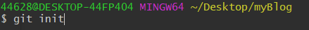
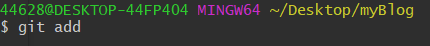
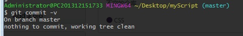

# 创建版本库
## 创建空目录
创建空目录，并进入。
## 在gitbush上输入git init

通过git init 命令将次目录变成Git可以管理的仓库
注 ：此时会发现多了一个.git 目录，此目录用来管理版本库。

# 将文件加入仓库
## 输入命令 git add

git add命令主要用于把我们要提交的文件的信息添加到索引库中,用命令git add告诉Git，把文件添加到仓库
# 把文件提交到仓库
## 输入命令 git commit -v

这个命令可以帮助我们把文件提交到仓库
 