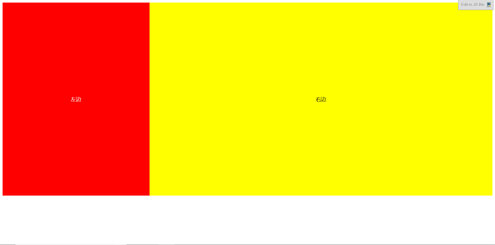
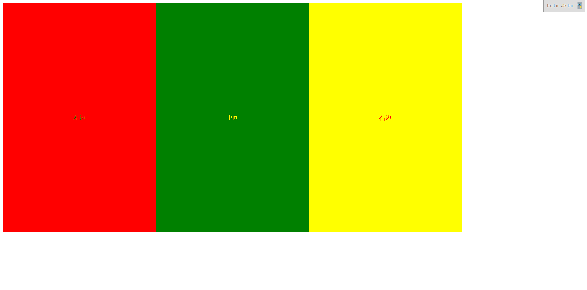
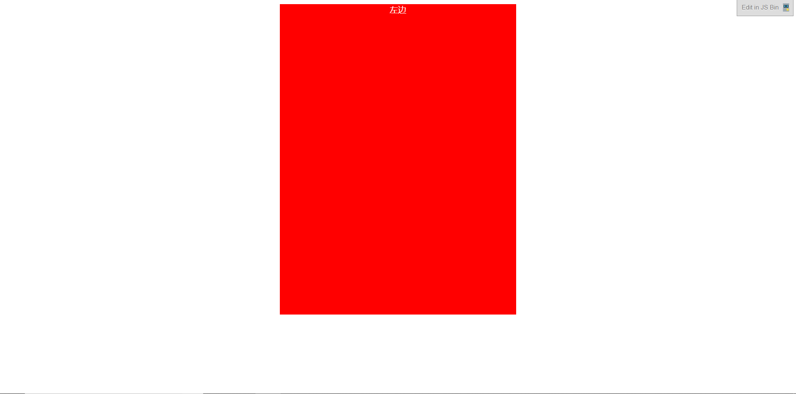
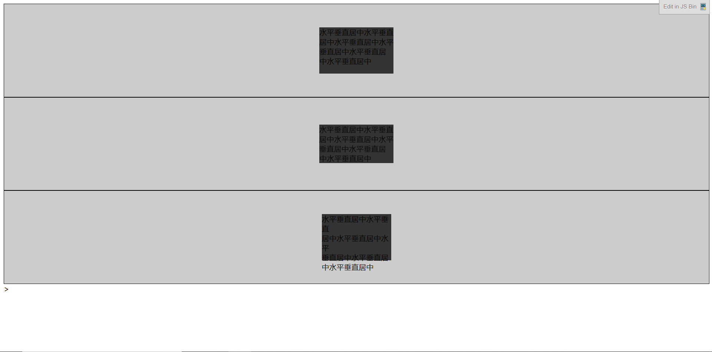

# 左右布局
## 浮动
***
这里使用了**浮动**来实现左右布局。
```
<body>
  <div class="left">左边</div>
  <div class="right">右边</div>
</body>
```
```
.left{
  float: left;
  width: 30%;
  height: 600px;
  background: red;
  text-align: center;
  line-height: 600px;
  color: #fff;
}

.right{
  float: left;
  width: 70%;
  height: 600px;
  background: yellow;
  text-align: center;
  line-height: 600px;
}
```
**显示效果**

浮动为什么会被使用在布局中呢？因为设置浮动后的元素会形成BFC（使得内部的元素不会被外部所干扰），并且元素的宽度也不再自适应父元素宽度，而是适应自身内容。这样就可以，轻松地实现多栏布局的效果。
类似于ps中的图层一样，浮动的元素会在浮动层上面进行排布，而在原先文档流中的元素位置，会被以某种方式进行删除，但是还是会影响布局。如果做过浮动，但未做清除，那么将会造成**高度塌陷**的问题。而**清除浮动**，最常用的方法有两种:
 * overflow: 将父元素的overflow，设置成hidden。
 * after伪类：对子元素的after伪类进行设置。
 ## 定位
 ***
 除了浮动以外，使用**定位**也可以实现同样的效果
```
 .left{
  position: relative;
  width: 400px;
  height: 600px;
  background: red;
  text-align: center;
  line-height: 600px;
  color: #fff;
}
.right{
  position: absolute;
  left:400px;
  top:-600px;
  width:400px;
  height: 600px;
  background: yellow;
  text-align: center;
  line-height: 600px;
}
```
这是用的position定位实现的左右布局
# 左中右布局
***
**代码如下**
```
<div class="left">左边</div>
<div class="middle">中间</div>
<div class="right">右边</div>
```
```
.left{
  float:left;
  width: 400px;
  height: 600px;
  background: red;
  text-align: center;
  line-height: 600px;
  color: green;
}
.middle{ 
  float:left;
  width:400px;
  height: 600px;
  background:green;
  text-align: center;
  line-height: 600px;
  color: yellow;
}
.right{
  float: left;
  width:400px;
  height: 600px;
  background: yellow;
  text-align: center;
  line-height: 600px;
  color:red;
}
```
**显示效果**

# 水平居中
***
```
<body>
  <div class="left">左边</div>
</body>
```
```
.left{
  width: 30%;
  height: 600px;
  background: red;
  text-align: center;
  color: #fff;
  margin:0 auto;
}
```
这里使用`margin:0 auto`使整个盒子水平居中，使用`text-align: center;`属性，实现内容居中。
**显示效果**

# 垂直居中
***
```
<div class="wrap">
  <div class="content">垂直居中</div>
</div>
```
```
@wrapWidth : 400px;

.wrap{
  margin-left: auto;
  margin-right: auto;
  margin-top: 20px;
  width: @wrapWidth;
  height: @wrapWidth;
  background-color: #ccc;
}

.content{
  @contentWidth : 100px;
  width: @contentWidth;
  height: @contentWidth;
  padding: (@wrapWidth - @contentWidth) / 2;
  background-color: #fff;
  background-clip:content-box;
}
```
文本垂直居中使用`line-height`,令其值与`height`相同。
盒模型垂直居中使用`padding`填充来实现，当然使用`margin`也是同样的道理。
**显示效果**

# 等其他小技巧
***
## 让我来用absolute布局上下文下的水平垂直居中
```
<body>
  <div class="wrap">
  <div class="ele margin">水平垂直居中水平垂直<br>居中水平垂直居中水平<br>垂直居中水平垂直居<br>中水平垂直居中</div>
</div>

<div class="wrap">
  <div class="ele translate">水平垂直居中水平垂直<br>居中水平垂直居中水平<br>垂直居中水平垂直居<br>中水平垂直居中</div>
</div>

<div class="wrap">
  <div class="ele relative">
    <div class="ele-inner">水平垂直居中水平垂直<br>居中水平垂直居中水平<br>垂直居中水平垂直居<br>中水平垂直居中</div>
  </div>
</div>>
</body>
```
```
.wrap{
  position: relative;
  width: 100%;
  height: 200px;
  border:1px solid;
  background-color: #ccc;}
.ele{
    position: absolute;
    left: 50%;
    top: 50%;
    background-color: #333;}
.margin{
      width: 160px;
      height: 100px;
      margin-left: -80px;
      margin-top: -50px;
    }
.translate{
      -webkit-transform:translate3d(-50%, -50%, 0);
      transform:translate3d(-50%, -50%, 0);
    }
.ele-inner{
      position: relative;
      left: -50%;
      top: -50%;
      width: 100%;
      height: 100%;
      background-color: #333;
    }
```
原理很简单，就是利用`left：50%`将盒子的左边先置于父容器的中点，然后再将盒子往左偏移盒子自身宽度的50%。
上面三个方法中，`margin`方法和`relative`方法都需要知道元素的宽高才行(`relative`方法只知道高也行)，适用于固定式布局，而`transform`方法则可以不知道元素宽高。
**显示效果**
