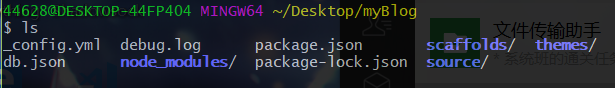
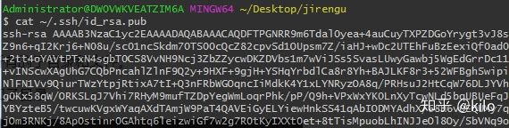
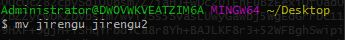
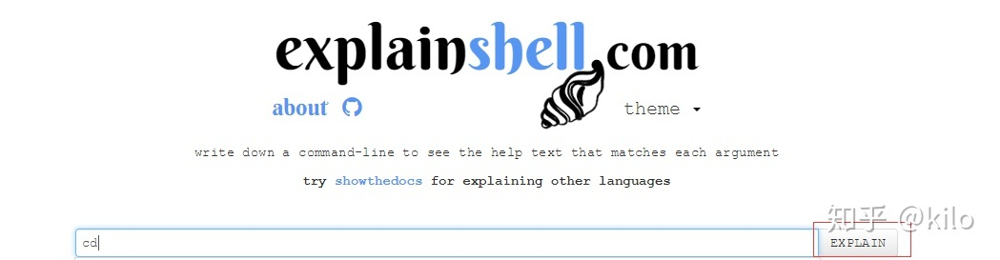
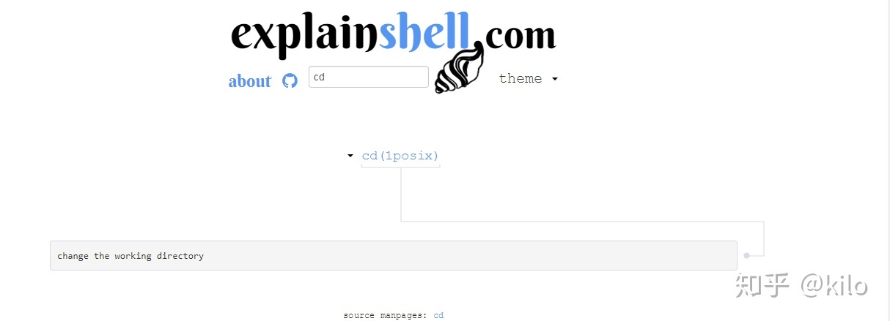
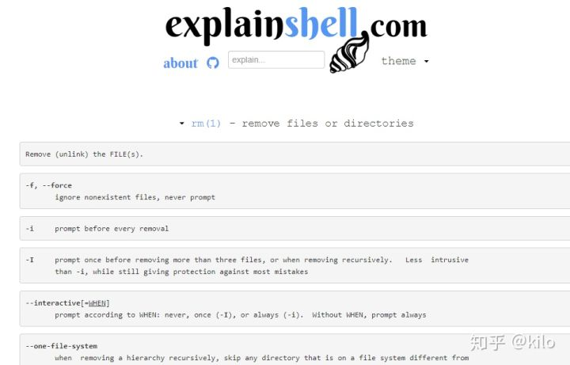

# 常用命令行使用
## 关于ls
ls命令是我们最常用的命令之一，全称list，罗列的意思，顾名思义ls这个命令可以查看文件权限（包括目录、文件夹、文件权限），在日常的命令行操作中应用极多
### 命令格式：

ls [选项] [目录名]

### 命令功能：

列出目标目录中所有的子目录和文件。

### 常用参数：

-a, –all 列出目录下的所有文件，包括以 . 开头的隐含文件

-A 同-a，但不列出“.”(表示当前目录)和“..”(表示当前目录的父目录)。

-c  配合 -lt：根据 ctime 排序及显示 ctime (文件状态最后更改的时间)配合 -l：显示 ctime 但根据名称排序否则：根据 ctime 排序

-C 每栏由上至下列出项目

–color[=WHEN] 控制是否使用色彩分辨文件。WHEN 可以是'never'、'always'或'auto'其中之一

-d, –directory 将目录象文件一样显示，而不是显示其下的文件。

-D, –dired 产生适合 Emacs 的 dired 模式使用的结果

-f 对输出的文件不进行排序，-aU 选项生效，-lst 选项失效

-g 类似 -l,但不列出所有者

-G, –no-group 不列出任何有关组的信息

-h, –human-readable 以容易理解的格式列出文件大小 (例如 1K 234M 2G)

–si 类似 -h,但文件大小取 1000 的次方而不是 1024

-H, –dereference-command-line 使用命令列中的符号链接指示的真正目的地

–indicator-style=方式 指定在每个项目名称后加上指示符号<方式>：none (默认)，classify (-F)，file-type (-p)

-i, –inode 印出每个文件的 inode 号

-I, –ignore=样式 不印出任何符合 shell 万用字符<样式>的项目

-k 即 –block-size=1K,以 k 字节的形式表示文件的大小。

-l 除了文件名之外，还将文件的权限、所有者、文件大小等信息详细列出来。

-L, –dereference 当显示符号链接的文件信息时，显示符号链接所指示的对象而并非符号链接本身的信息

-m 所有项目以逗号分隔，并填满整行行宽

-o 类似 -l,显示文件的除组信息外的详细信息。   

-r, –reverse 依相反次序排列

-R, –recursive 同时列出所有子目录层

-s, –size 以块大小为单位列出所有文件的大小

-S 根据文件大小排序

–sort=WORD 以下是可选用的 WORD 和它们代表的相应选项：

extension -X status -c

none -U time -t

size -S atime -u

time -t access -u

version -v use -u

-t 以文件修改时间排序

-u 配合 -lt:显示访问时间而且依访问时间排序

配合 -l:显示访问时间但根据名称排序

否则：根据访问时间排序

-U 不进行排序;依文件系统原有的次序列出项目

-v 根据版本进行排序

-w, –width=COLS 自行指定屏幕宽度而不使用目前的数值

-x 逐行列出项目而不是逐栏列出

-X 根据扩展名排序

-1 每行只列出一个文件

–help 显示此帮助信息并离开

–version 显示版本信息并离开
## 关于cat
cat 命令用于连接文件并打印到标准输出设备上。这个命令常用来显示文件内容，或者将几个文件连接起来显示，或者从标准输入读取内容并显示，它常与重定向符号配合使用.
### 命令格式：

cat [选项] [文件]...

### 命令功能：

cat主要有三大功能：

1.一次显示整个文件:cat filename

2.从键盘创建一个文件:cat > filename 只能创建新文件,不能编辑已有文件.

3.将几个文件合并为一个文件:cat file1 file2 > file

### 命令参数：

-A, --show-all           等价于 -vET

-b, --number-nonblank    对非空输出行编号

-e                       等价于 -vE

-E, --show-ends          在每行结束处显示 $

-n, --number     对输出的所有行编号,由1开始对所有输出的行数编号

-s, --squeeze-blank  有连续两行以上的空白行，就代换为一行的空白行 

-t                       与 -vT 等价

-T, --show-tabs          将跳格字符显示为 ^I

-u                       (被忽略)

-v, --show-nonprinting   使用 ^ 和 M- 引用，除了 LFD 和 TAB 之外
## 关于mv
mv命令是move的缩写，可以用来移动文件或者将文件改名（move (rename) files），是Linux系统下常用的命令，经常用来备份文件或者目录.
### 命令格式

    mv [选项] 源文件或目录 目标文件或目录

### 命令功能：

视mv命令中第二个参数类型的不同（是目标文件还是目标目录），mv命令将文件重命名或将其移至一个新的目录中。当第二个参数类型是文件时，mv命令完成文件重命名，此时，源文件只能有一个（也可以是源目录名），它将所给的源文件或目录重命名为给定的目标文件名。当第二个参数是已存在的目录名称时，源文件或目录参数可以有多个，mv命令将各参数指定的源文件均移至目标目录中。在跨文件系统移动文件时，mv先拷贝，再将原有文件删除，而链至该文件的链接也将丢失。

### 命令参数：

-b ：若需覆盖文件，则覆盖前先行备份。 

-f ：force 强制的意思，如果目标文件已经存在，不会询问而直接覆盖；

-i ：若目标文件 (destination) 已经存在时，就会询问是否覆盖！

-u ：若目标文件已经存在，且 source 比较新，才会更新(update)

	   -t  ： --target-directory=DIRECTORY move all SOURCE arguments into DIRECTORY，即指定mv的目标目录，该选项适用于移动多个源文件到一个目录的情况，此时目标目录在前，源文件在后
       
## 关于touch
linux的touch命令不常用，一般在使用make的时候可能会用到，用来修改文件时间戳，或者新建一个不存在的文件。

### 命令格式：

touch [选项]... 文件...

### 命令参数：

-a   或--time=atime或--time=access或--time=use 　只更改存取时间。

-c   或--no-create 　不建立任何文档。

-d 　使用指定的日期时间，而非现在的时间。

-f 　此参数将忽略不予处理，仅负责解决BSD版本touch指令的兼容性问题。

-m   或--time=mtime或--time=modify 　只更改变动时间。

-r 　把指定文档或目录的日期时间，统统设成和参考文档或目录的日期时间相同。

-t 　使用指定的日期时间，而非现在的时间。

### 命令功能：

touch命令参数可更改文档或目录的日期时间，包括存取时间和更改时间。 

# 命令行相关网站
如何使用 http://explainshell.com 这个网站
explanshell这个网站是用来查看命令行释义的工具型网站。

## 搜索命令
在搜索框输入要搜索的命令比如“cd”，然后点框框中的“Explain”进行搜索就能得到它的释义啦。

## 得到结果
搜索后得到的结果是这样的。可以看到它用一句话概况说明了该命令行的含义。

## 点开
点开它能得到更详细的释义和用法

